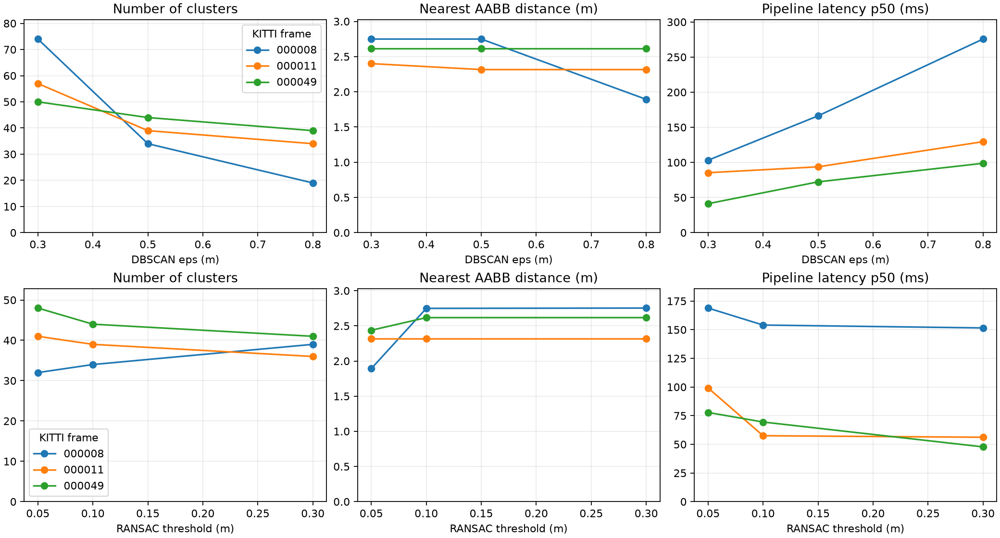
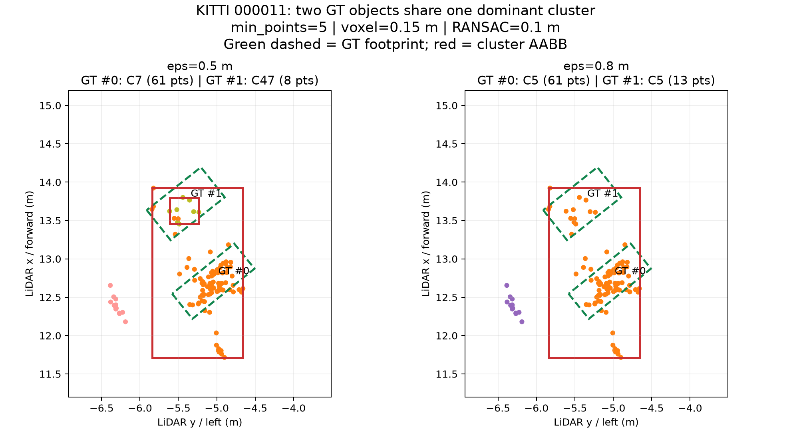

# Báo cáo Day 6: Độ nhạy của pipeline phát hiện vật cản

- **Họ tên:** Tống Trần Tiến Dũng
- **MSSV:** 2A202602791
- **Lớp:** AI20K-T4
- **Link repo:** https://github.com/Tiendung3tzz/TongTranTienDung-2A202602791-Track4-Day21
- **Topic:** D — Robot/drone obstacle
- **Dataset:** data/kitti_mini (kết quả chính); data/synthetic, data/nuscenes_mini_subset (kiểm tra projection)
- **Các frame đã dùng:** KITTI 000008 (đông xe), 000011 (người đi bộ), 000049 (che khuất); synthetic 000000; nuScenes scene-0103_010

## 1. Claim

Giữ voxel 0.15 m, RANSAC 0.1 m, min_points 10, seed 42 và ROI x∈[1,40] m, |y|≤15 m, z∈[−3,2] m, tăng DBSCAN eps 0.3→0.8 m làm số cụm giảm **ít nhất 20% trên cả 3 frame KITTI đã chọn**. Kết quả: 000008: 74→19 (−74.3%); 000011: 57→34 (−40.4%); 000049: 50→39 (−22.0%).
Claim nháp CP1 yêu cầu ít nhất 2/3 frame; số liệu xác nhận 3/3, nhưng **số cụm giảm không phải độ chính xác tăng**: noise giảm, cụm có thể nối/gộp và failure ở mục 3 minh hoạ điều này. Ba frame là phạm vi kết luận, chưa đại diện mọi đường/sensor.

## 2. Evidence

Pipeline: điểm hữu hạn/ROI → Open3D voxel → RANSAC 300 iterations trên điểm z<−0.8 m → giữ độ cao trên plane > threshold → DBSCAN → AABB từng cụm. Fit plane hướng z-up, tilt≤20°; lỗi fit/thiếu điểm thì raise, không trả kết quả đường trống. Sửa đúng hai TODO trong starter/projection.py; toàn bộ code khác nằm src/.
Hai quét **độc lập**, mỗi quét 3 mức × 3 frame; quét eps cố định RANSAC=0.1 m, quét RANSAC cố định eps=0.5 m, voxel/min_points/seed/ROI không đổi. CSV đầy đủ: [obstacle_sweep.csv](../results/obstacle_sweep.csv); kích thước/điểm từng box: [obstacle_clusters.csv](../results/obstacle_clusters.csv); [GT support](../results/obstacle_gt_support.csv) là đếm điểm trong box label, **không phải precision/recall detector**. Gần nhất là khoảng cách XY từ gốc LiDAR đến footprint AABB, không phải centroid hay khoảng cách va chạm tới thân robot.

| Frame | eps (m) | Số cụm | Gần nhất (m) | p50 / p95 (ms) |
|---|---:|---:|---:|---:|
| 000008 | 0.3 | 74 | 2.749 | 103.1 / 133.2 |
| 000008 | 0.5 | 34 | 2.749 | 166.3 / 219.6 |
| 000008 | 0.8 | 19 | 1.893 | 275.7 / 330.5 |
| 000011 | 0.3 | 57 | 2.400 | 85.4 / 100.2 |
| 000011 | 0.5 | 39 | 2.316 | 93.7 / 115.3 |
| 000011 | 0.8 | 34 | 2.316 | 129.5 / 164.2 |
| 000049 | 0.3 | 50 | 2.618 | 41.3 / 50.3 |
| 000049 | 0.5 | 44 | 2.618 | 72.3 / 84.2 |
| 000049 | 0.8 | 39 | 2.618 | 98.8 / 148.3 |

| Frame | RANSAC (m) | Điểm giữ lại | Số cụm | Gần nhất (m) | p50 / p95 (ms) |
|---|---:|---:|---:|---:|---:|
| 000008 | 0.05 | 11563 | 32 | 1.893 | 168.9 / 199.0 |
| 000008 | 0.10 | 11016 | 34 | 2.749 | 154.1 / 177.2 |
| 000008 | 0.30 | 9176 | 39 | 2.754 | 151.5 / 181.8 |
| 000011 | 0.05 | 7523 | 41 | 2.316 | 99.2 / 118.6 |
| 000011 | 0.10 | 6620 | 39 | 2.316 | 57.5 / 71.9 |
| 000011 | 0.30 | 5898 | 36 | 2.316 | 56.2 / 67.5 |
| 000049 | 0.05 | 7131 | 48 | 2.438 | 77.8 / 101.9 |
| 000049 | 0.10 | 6682 | 44 | 2.618 | 69.5 / 90.1 |
| 000049 | 0.30 | 5594 | 41 | 2.618 | 47.8 / 62.0 |




Ảnh trước/sau đủ 4 bước có cho [000008](../results/figures/obstacle_demo_000008.png), [000011](../results/figures/obstacle_demo_000011.png), [000049](../results/figures/obstacle_demo_000049.png). Ngưỡng RANSAC 0.05→0.30 m làm giảm số điểm giữ lại, nhưng số cụm 000008 tăng 32→39: xoá các điểm nối có thể tách một cụm lớn thành nhiều mảnh, nên không giả định số cụm luôn giảm theo ngưỡng đất.
**[B3] Latency:** [obstacle_latency.csv](../results/obstacle_latency.csv) có 360 lượt đo, bỏ 1 warm-up/cấu hình rồi đo 20 lượt bằng perf_counter; p50/p95 của từng cấu hình trong hai bảng. Đo đủ pipeline số học, loại IO/import/plot/GT khỏi khoảng đo. CPU 11th Gen Intel(R) Core(TM) i5-1135G7 @ 2.40GHz, RAM 7.7 GiB, Windows, CPython 3.12.14, Open3D 0.19.0, OMP=1, không GPU; [hardware.json](../results/hardware.json). Mọi lượt có plane và label giống warm-up; thời gian thay đổi theo tải máy, hai quét có baseline trùng cấu hình nhưng timing không nhất thiết bằng nhau.
**Advanced:** [occupancy BEV](../results/figures/occupancy_000011.png) dùng ô 0.25 m, giữ cả điểm DBSCAN noise: ô có điểm là occupied, ô vắng điểm là unknown, không suy diễn free-space. [Slide CP6](slides/TOPIC_D.pptx) có ghi chú trình bày 3 phút.

## 3. Failure case



- **Trường hợp:** KITTI 000011, Pedestrian #0 và #1 ở 13.41/14.48 m trong camera; thí nghiệm riêng giữ voxel 0.15 m, RANSAC 0.1 m, seed 42, **min_points=5 ở cả hai cấu hình** (benchmark chính dùng 10).
- **Quan sát:** eps=0.5 m: cụm trội C7 chứa 61 điểm của GT #0, C47 chứa 8 điểm của GT #1; eps=0.8 m: cùng C5 chứa 61 và 13 điểm. CSV: [failure_merge.csv](../results/failure_merge.csv); #1 chỉ có 19 điểm voxel trong box, nên các mảnh còn lại có thể là noise/cụm phụ.
- **Nguyên nhân:** DBSCAN dùng kết nối mật độ; eps lớn nối chuỗi điểm giữa hai vật, không biết danh tính người. Ảnh dùng footprint GT nét xanh và AABB cụm nét đỏ; đây là lỗi tách instance, không chứng minh robot sẽ bỏ sót vùng có vật cản.
- **Lớp debug:** **Preprocess**, tham số clustering; I/O đã verify, Geometry có kiểm tra bottom-center/rotation và projection; đây là một frame LiDAR nên không có giả thuyết lệch thời gian, không dùng checkpoint model.
- **Cách phát hiện khi chạy thật:** theo dõi kích thước cụm, số điểm và biến động số cụm; box rộng/ngang >2 m hoặc số cụm giảm >40% trong hai frame là cờ cần kiểm tra, phải hiệu chỉnh trên log robot. Khi gán nhãn kiểm chứng, dùng nhiều GT chia sẻ cụm trội; không có GT thì cờ trên chỉ là heuristic, không đảm bảo phát hiện mọi lần gộp.

## 4. Khuyến nghị nếu triển khai thật

Robot kho tốc độ đề xuất ≤0.5 m/s nên bắt đầu thử voxel=0.15 m, RANSAC=0.1 m, eps=0.5 m; eps lớn giảm noise nhưng gộp instance và tăng latency. Không chọn ngưỡng theo riêng số cụm; dữ liệu kho, người ngồi/pallet thấp, dốc và LiDAR lắp thấp cần kiểm thử riêng trước vận hành.
Đánh đổi: voxel lớn tiết kiệm CPU nhưng mất vật nhỏ; ngưỡng đất 0.3 m bỏ nhiều điểm thấp, vì vậy giữ 0.1 m làm điểm khởi đầu. Tốc độ pipeline trên máy này chỉ là CPU processing, cần đo cả IO/điều khiển/end-to-end trước chọn tần số robot.
Log n_input/n_roi/n_obstacle/n_noise, plane/tilt, n_clusters, kích thước box, nearest_m và latency p95. Ngưỡng thử nghiệm: p95>200 ms, tilt>20°/fit lỗi hoặc mật độ điểm giảm >50% so baseline thì giảm tốc/dừng kiểm tra; nearest_m<1 m thì yêu cầu dừng sau khi hiệu chỉnh theo footprint và quãng đường phanh. Các ngưỡng này là đề xuất kiểm thử, chưa được chứng nhận an toàn.

## 5. Cách chạy lại

Dùng Python 3.12, chạy từ **gốc repo**, tạo/activate .venv; seed=42, OMP_NUM_THREADS=1. Các thư viện đã kiểm chứng được pin trong src/requirements-topic-d.txt. Lệnh dưới tái tạo mọi bảng số liệu và ảnh; latency có thể khác theo tải máy nhưng số cụm/điểm phải khớp.

```bash
python -m venv .venv
# PowerShell: .venv\Scripts\Activate.ps1
# macOS/Linux: source .venv/bin/activate
python -m pip install -r src/requirements-topic-d.txt
python tools/verify_data.py --data-root data/kitti_mini
python tools/verify_data.py --data-root data/nuscenes_mini_subset
python -m starter.data_health --data-root data/synthetic
python -m src.test_projection
python -m src.test_obstacle
python -m starter.projection --data-root data/synthetic --frame 000000
python -m starter.projection --data-root data/kitti_mini --frame 000011
python -m starter.projection --data-root data/nuscenes_mini_subset --frame scene-0103_010
python -m src.obstacle
python -m src.experiment
python -m src.failure
python -m src.occupancy
python -m src.build_report
python tools/check_submission.py
```

**[B4] Tool dùng lại:** python -m src.obstacle --help, python -m src.experiment --help, python -m src.failure --help và python -m src.occupancy --help liệt kê tham số, đơn vị, mặc định; chạy không tham số tạo kết quả trên data/kitti_mini. Pipeline obstacle dành cho **trục KITTI**, không áp nguyên ROI lên nuScenes; nuScenes trong bài này chỉ kiểm tra projection. Slide đi kèm đã export; source src/build_slides.mjs dùng bundled @oai/artifact-tool trong Codex và đọc chính các CSV này.

Để dựng lại PPTX trong Codex trên máy hiện tại (PowerShell; chọn tên output mới):

```powershell
$env:SLIDES_OUTPUT = 'report/slides/TOPIC_D_REBUILT.pptx'
& 'C:/Users/ADMIN/.cache/codex-runtimes/codex-primary-runtime/dependencies/node/bin/node.exe' src/build_slides.mjs
```

Kiểm tra tái lập: agent đã clone source CP4 vào thư mục riêng, chạy lại kiểm tra projection/4 unit tests và cả 18 cấu hình × 20 lượt; mọi cột metric số học khớp chính xác CSV gốc khi bỏ cột latency. Không thay dữ liệu gốc trong data/ và chỉ REPORT.md được sửa trong các Markdown của đề bài.

## 6. Khai báo sử dụng AI

| Công cụ / nguồn | Dùng cho việc gì | Đã kiểm chứng thế nào |
|---|---|---|
| Codex (OpenAI) | Viết hai TODO projection, pipeline/CLI, thí nghiệm, tests, biểu đồ, failure, báo cáo và slide; thực hiện commit/push | Agent đã chạy verify_data, kiểm tra số 3910/19946/3120, 4 unit tests hình học/đất/cụm, 360 lượt số học tái lập và đối chiếu CSV với ảnh. Học viên chưa xác nhận đã tự chạy kiểm chứng; cần đọc, chạy lại và giải thích mọi dòng trước vấn đáp |
| Codelab Day 6 | Trình tự checkpoint và phép thử CP2 (10,0,0) | src.test_projection kiểm tra z_cam≈9.73 và uv≈(614,175), thêm empty/Inf và ba dataset; không dùng script yaw topic A làm thí nghiệm topic D |
| [Open3D documentation](https://www.open3d.org/docs/release/tutorial/geometry/pointcloud.html) | Tra API voxel_down_sample, segment_plane, cluster_dbscan, không chép source | Chạy trên ba frame KITTI; seed cố định, kiểm tra plane z-up; failure được xác minh bằng điểm voxel nằm trong 3D GT box |
