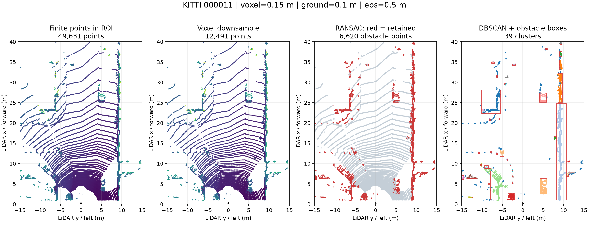

# Báo cáo Day 6: Độ nhạy của pipeline phát hiện vật cản

> CP1: claim nháp; kết luận sẽ được cập nhật bằng số liệu chạy thật.

- **Họ tên:** Tống Trần Tiến Dũng
- **MSSV:** 2A202602791
- **Lớp:** AI20K-T4
- **Link repo:** https://github.com/Tiendung3tzz/TongTranTienDung-2A202602791-Track4-Day21
- **Topic:** D — Robot/drone obstacle
- **Dataset:** data/kitti_mini (chính), data/synthetic và data/nuscenes_mini_subset (kiểm tra projection)
- **Các frame đã dùng:** KITTI 000008, 000011, 000049; synthetic 000000; nuScenes scene-0103_010

> Hãy viết ngắn: mỗi mục từ 3 đến 8 dòng, ưu tiên số liệu và hình ảnh.

## 1. Claim

Claim nháp: Tăng DBSCAN eps từ 0.3 m lên 0.8 m, giữ voxel 0.15 m, ngưỡng RANSAC 0.1 m và min_points 10, làm số cụm giảm ít nhất 20% trên ít nhất 2/3 frame KITTI 000008, 000011, 000049. Nếu số liệu bác bỏ giả thuyết, sẽ ghi rõ kết luận thực tế.

## 2. Evidence

CP2: pipeline lọc điểm hữu hạn/ROI → voxel → RANSAC → DBSCAN → AABB chạy trên KITTI 000011; có 39 cụm, 6620 điểm sau tách đất, khoảng cách AABB gần nhất 2.316 m. ROI: x 1–40 m, |y| ≤ 15 m, z −3–2 m. Projection pass: 3910/19946/3120 điểm vào ảnh, đúng ba giá trị trong hướng dẫn.



## 3. Failure case

CP4 sẽ kiểm tra DBSCAN gộp hai vật sát nhau và ngưỡng RANSAC làm mất điểm thấp; chỉ kết luận từ ảnh và số liệu thực tế.

## 4. Khuyến nghị nếu triển khai thật

Robot kho chạy chậm cần ưu tiên giữ vật thấp; ground plane nghiêng quá 20° hoặc thiếu điểm fit thì báo lỗi, không suy diễn là đường trống. Ngưỡng vận hành sẽ được đề xuất sau thí nghiệm.

## 5. Cách chạy lại

```bash
python -m pip install -r src/requirements-topic-d.txt
python tools/verify_data.py --data-root data/kitti_mini
python tools/verify_data.py --data-root data/nuscenes_mini_subset
python -m starter.data_health --data-root data/synthetic
python -m src.test_projection
python -m starter.projection --data-root data/synthetic --frame 000000
python -m starter.projection --data-root data/kitti_mini --frame 000011
python -m starter.projection --data-root data/nuscenes_mini_subset --frame scene-0103_010
python -m src.obstacle
```

## 6. Khai báo sử dụng AI

| Công cụ | Dùng cho việc gì | Bạn đã kiểm chứng thế nào |
|---|---|---|
| Codex (OpenAI) | Viết code, chạy kiểm tra, thiết kế thí nghiệm và biên soạn báo cáo | Agent đã chạy kiểm tra dữ liệu và projection trên ba dataset, tạo ảnh bằng code thật; học viên cần tự đọc, chạy lại và giải thích code trước vấn đáp, chưa xác nhận đã tự kiểm chứng |
